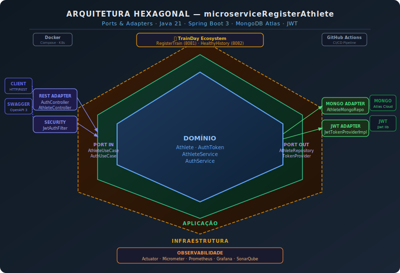
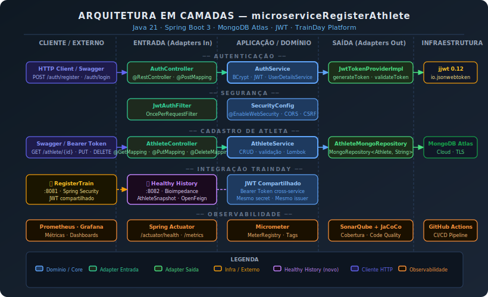

# 🏋️ Microservice Register Athlete

API REST para **cadastro, autenticação e gerenciamento de atletas**, parte da plataforma **TrainDay** — um ecossistema de microserviços para acompanhamento de treino e saúde de atletas.

---

## 📋 Índice

- [Sobre a Plataforma TrainDay](#-sobre-a-plataforma-trainday)
- [Sobre este Serviço](#-sobre-este-serviço)
- [Tecnologias](#-tecnologias)
- [Arquitetura](#-arquitetura)
- [Rodando localmente](#-rodando-localmente)
- [Docker](#-docker)
- [Kubernetes com Minikube](#-kubernetes-com-minikube)
- [SonarQube](#-sonarqube)
- [Observabilidade](#-observabilidade)
- [Endpoints](#-endpoints)
- [Integração com Healthy History](#-integração-com-healthy-history)

---

## 🌐 Sobre a Plataforma TrainDay

O **TrainDay** é uma plataforma CRM para atletas e bodybuilders, composta por três microserviços independentes que se comunicam via JWT compartilhado:

| Serviço | Porta | Responsabilidade |
|---|---|---|
| **microserviceRegisterAthlete** *(este)* | `8080` | Cadastro e autenticação de atletas |
| **microserviceRegisterTrain** | `8081` | Registro e gerenciamento de treinos |
| **microserviceTrainHealth** *(Healthy History)* | `8082` | Histórico de saúde, bioimpedância e avaliações clínicas |

---

## 🎯 Sobre este Serviço

O **microserviceRegisterAthlete** é o ponto de entrada do ecossistema TrainDay. Ele é responsável por:

- Registro e autenticação de atletas com JWT
- Gerenciamento de perfil do atleta
- Emissão de tokens Bearer utilizados pelos demais serviços da plataforma
- Geração do `AthleteSnapshot` — estrutura imutável de dados do atleta consumida pelos serviços de treino e saúde

---

## 🛠 Tecnologias

- **Java 21**
- **Spring Boot 3.3.5**
- **Spring Security + JWT** (`jjwt 0.12`)
- **MongoDB Atlas** (banco de dados em nuvem)
- **Lombok** — redução de boilerplate
- **OpenAPI 3 / Swagger UI**
- **Spring Actuator + Micrometer + Prometheus + Grafana**
- **JaCoCo** — cobertura de testes
- **SonarQube** — qualidade de código
- **Docker / Docker Compose**
- **Kubernetes (Minikube)**
- **GitHub Actions** — CI/CD

---

## 🏛 Arquitetura

O serviço segue o padrão **Hexagonal (Ports & Adapters)**, garantindo isolamento total entre domínio, aplicação e infraestrutura.

[](docs/arquitetura_hexagonal_register_athlete.svg)

[](docs/arquitetura_camadas_register_athlete.svg)

### Estrutura de pacotes

```
src/main/java/com/trainday/registerathlete/
├── domain/
│   ├── model/          # Athlete, AuthToken
│   └── port/
│       ├── in/         # AthleteUseCase, AuthUseCase
│       └── out/        # AthleteRepositoryPort, TokenProviderPort
├── application/
│   └── service/        # AthleteService, AuthService
├── adapter/
│   ├── in/
│   │   └── rest/       # AthleteController, AuthController
│   └── out/
│       ├── persistence/ # AthleteMongoRepository
│       └── security/    # JwtTokenProviderImpl
└── config/             # SecurityConfig, OpenApiConfig, ObservabilityConfig
```

---

## 🚀 Rodando localmente

### Pré-requisitos

- Java 21
- Maven 3.9+
- Variáveis de ambiente configuradas (`.env` ou export):

```bash
export MONGODB_URI=mongodb+srv://<user>:<password>@cluster.mongodb.net/trainday
export JWT_SECRET=sua-chave-secreta-com-minimo-64-caracteres
export JWT_EXPIRATION=3600000
```

### Executar

```bash
# Clone o repositório
git clone https://github.com/Danielpernnasc/microserviceRegisterAthlete.git
cd microserviceRegisterAthlete

# Build e execução
./mvnw spring-boot:run
```

A API estará disponível em `http://localhost:8080`  
Swagger UI: `http://localhost:8080/swagger-ui.html`

---

## 🐳 Docker

### Dockerfile

O projeto inclui um `Dockerfile` multi-stage na raiz:

```dockerfile
FROM eclipse-temurin:21-jdk-alpine AS build
WORKDIR /app
COPY . .
RUN ./mvnw clean package -DskipTests

FROM eclipse-temurin:21-jre-alpine
WORKDIR /app
COPY --from=build /app/target/*.jar app.jar
EXPOSE 8080
ENTRYPOINT ["java", "-jar", "app.jar"]
```

### Comandos Docker

```bash
# Build da imagem
docker build -t register-athlete:latest .

# Rodar o container
docker run -p 8080:8080 \
  -e MONGODB_URI=mongodb+srv://... \
  -e JWT_SECRET=sua-chave-secreta-com-minimo-64-caracteres \
  -e JWT_EXPIRATION=3600000 \
  register-athlete:latest

# Ver logs
docker logs <container_id>

# Parar
docker stop <container_id>
```

### Docker Compose

```bash
# Subir toda a stack TrainDay
docker-compose up -d

# Parar
docker-compose down
```

O `docker-compose.yaml` sobe o `microserviceRegisterAthlete` junto com Prometheus e Grafana para observabilidade local.

---

## ☸️ Kubernetes com Minikube

### Pré-requisitos

```bash
# Instalar Minikube
curl -LO https://storage.googleapis.com/minikube/releases/latest/minikube-linux-amd64
sudo install minikube-linux-amd64 /usr/local/bin/minikube

# Instalar kubectl
curl -LO "https://dl.k8s.io/release/$(curl -L -s https://dl.k8s.io/release/stable.txt)/bin/linux/amd64/kubectl"
sudo install kubectl /usr/local/bin/kubectl
```

### Iniciar o cluster

```bash
minikube start
```

### Manifests Kubernetes

Estrutura `k8s/` na raiz:

```
k8s/
├── secret.yaml
├── deployment.yaml
└── service.yaml
```

**k8s/secret.yaml**

```yaml
apiVersion: v1
kind: Secret
metadata:
  name: athlete-secrets
type: Opaque
stringData:
  MONGODB_URI: "mongodb+srv://..."
  JWT_SECRET: "sua-chave-secreta-com-minimo-64-caracteres"
  JWT_EXPIRATION: "3600000"
```

**k8s/deployment.yaml**

```yaml
apiVersion: apps/v1
kind: Deployment
metadata:
  name: register-athlete
  labels:
    app: register-athlete
spec:
  replicas: 1
  selector:
    matchLabels:
      app: register-athlete
  template:
    metadata:
      labels:
        app: register-athlete
    spec:
      containers:
        - name: register-athlete
          image: register-athlete:latest
          imagePullPolicy: Never
          ports:
            - containerPort: 8080
          envFrom:
            - secretRef:
                name: athlete-secrets
          readinessProbe:
            httpGet:
              path: /actuator/health
              port: 8080
            initialDelaySeconds: 20
            periodSeconds: 10
          livenessProbe:
            httpGet:
              path: /actuator/health
              port: 8080
            initialDelaySeconds: 30
            periodSeconds: 15
```

**k8s/service.yaml**

```yaml
apiVersion: v1
kind: Service
metadata:
  name: register-athlete-service
spec:
  selector:
    app: register-athlete
  type: NodePort
  ports:
    - port: 80
      targetPort: 8080
      nodePort: 30080
```

### Deploy no Minikube

```bash
# Apontar o Docker para o registry do Minikube
eval $(minikube docker-env)

# Build da imagem dentro do Minikube
docker build -t register-athlete:latest .

# Aplicar os manifests
kubectl apply -f k8s/secret.yaml
kubectl apply -f k8s/deployment.yaml
kubectl apply -f k8s/service.yaml

# Verificar status
kubectl get pods
kubectl get services

# Acessar a aplicação
minikube service register-athlete-service --url

# Ver logs
kubectl logs -f deployment/register-athlete

# Deletar tudo
kubectl delete -f k8s/
```

---

## 📊 SonarQube

### Subir o SonarQube com Docker

```bash
docker run -d \
  --name sonarqube \
  -p 9000:9000 \
  sonarqube:lts-community
```

Acesse `http://localhost:9000` → login padrão: `admin` / `admin`

### Configurar no `pom.xml`

```xml
<properties>
  <sonar.projectKey>register-athlete</sonar.projectKey>
  <sonar.projectName>Register Athlete</sonar.projectName>
  <sonar.host.url>http://localhost:9000</sonar.host.url>
</properties>

<plugin>
  <groupId>org.sonarsource.scanner.maven</groupId>
  <artifactId>sonar-maven-plugin</artifactId>
  <version>3.10.0.2594</version>
</plugin>
```

### Rodar a análise

```bash
./mvnw verify sonar:sonar \
  -Dsonar.projectKey=register-athlete \
  -Dsonar.host.url=http://localhost:9000 \
  -Dsonar.token=SEU_TOKEN_AQUI
```

---

## 📡 Observabilidade

O serviço expõe métricas via **Spring Actuator + Micrometer**, coletadas pelo **Prometheus** e visualizadas no **Grafana**.

```bash
# Health check
GET http://localhost:8080/actuator/health

# Métricas Prometheus
GET http://localhost:8080/actuator/prometheus
```

Para subir a stack de observabilidade completa:

```bash
docker-compose -f docker-compose-observability.yml up -d
```

- **Prometheus**: `http://localhost:9090`
- **Grafana**: `http://localhost:3000` (admin/admin)

---

## 🔌 Endpoints

| Método | Rota | Autenticação | Descrição |
|--------|------|--------------|-----------|
| `POST` | `/auth/register` | Pública | Cadastro de novo atleta |
| `POST` | `/auth/login` | Pública | Login e geração de JWT |
| `GET` | `/athlete/{id}` | Bearer Token | Dados do atleta por ID |
| `GET` | `/athlete/me` | Bearer Token | Dados do atleta autenticado |
| `PUT` | `/athlete/{id}` | Bearer Token | Atualiza perfil do atleta |
| `DELETE` | `/athlete/{id}` | Bearer Token | Remove atleta |
| `GET` | `/actuator/health` | Pública | Health check |
| `GET` | `/actuator/prometheus` | Pública | Métricas |

### Exemplo de autenticação

```bash
# Registro
curl -X POST http://localhost:8080/auth/register \
  -H "Content-Type: application/json" \
  -d '{
    "name": "Daniel Pericles",
    "email": "daniel@trainday.com",
    "password": "senha123"
  }'

# Login
curl -X POST http://localhost:8080/auth/login \
  -H "Content-Type: application/json" \
  -d '{"email": "daniel@trainday.com", "password": "senha123"}'

# Usar o token JWT nas rotas protegidas
curl http://localhost:8080/athlete/me \
  -H "Authorization: Bearer SEU_TOKEN_JWT"
```

---

## 🩺 Integração com Healthy History

O **microserviceTrainHealth** (porta `8082`) consome dados deste serviço via **AthleteSnapshot** — um objeto imutável com os dados do atleta no momento do registro de saúde, garantindo consistência histórica mesmo que o perfil seja alterado posteriormente.

O token JWT emitido por este serviço é validado diretamente pelo `microserviceTrainHealth`, sem necessidade de chamadas inter-serviço para autenticação, desde que ambos compartilhem o mesmo `JWT_SECRET` e `JWT_ISSUER`.

```
RegisterAthlete (8080) ──JWT──► HealthyHistory (8082)
                                  ├── Bioimpedância
                                  ├── Análise Clínica
                                  ├── Consulta Nutricionista
                                  └── Snapshot do Atleta
```

---

## 👤 Autor

**Daniel Pericles**  
[github.com/Danielpernnasc](https://github.com/Danielpernnasc)  
[linkedin.com/in/danielpericles](https://www.linkedin.com/in/danielpericles)
